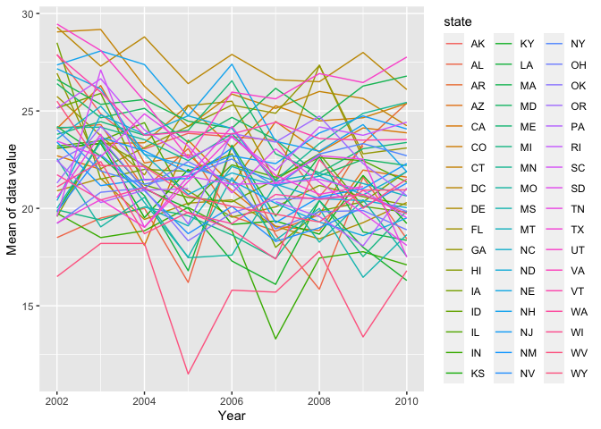
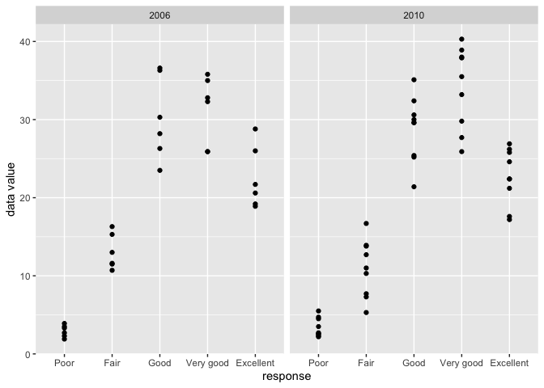
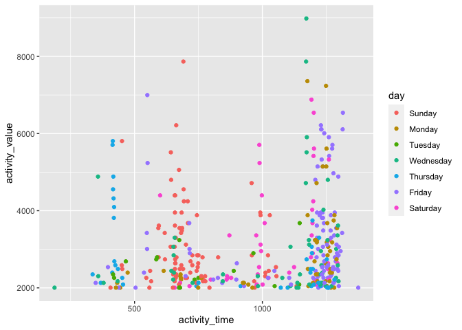

p8105\_hw03\_zy2392
================
Stephen Yuan
10/12/2021

# Problem 1

``` r
data("instacart")
instacart %>% 
  janitor::clean_names() %>% 
  head(10)
```

    ## # A tibble: 10 × 15
    ##    order_id product_id add_to_cart_order reordered user_id eval_set order_number
    ##       <int>      <int>             <int>     <int>   <int> <chr>           <int>
    ##  1        1      49302                 1         1  112108 train               4
    ##  2        1      11109                 2         1  112108 train               4
    ##  3        1      10246                 3         0  112108 train               4
    ##  4        1      49683                 4         0  112108 train               4
    ##  5        1      43633                 5         1  112108 train               4
    ##  6        1      13176                 6         0  112108 train               4
    ##  7        1      47209                 7         0  112108 train               4
    ##  8        1      22035                 8         1  112108 train               4
    ##  9       36      39612                 1         0   79431 train              23
    ## 10       36      19660                 2         1   79431 train              23
    ## # … with 8 more variables: order_dow <int>, order_hour_of_day <int>,
    ## #   days_since_prior_order <int>, product_name <chr>, aisle_id <int>,
    ## #   department_id <int>, aisle <chr>, department <chr>

## 1. Short description:

There are 1384617 observations and 15 features in the dataset –
instacart, variables include order\_id, product\_id,
add\_to\_cart\_order, reordered, user\_id, eval\_set, order\_number,
order\_dow, order\_hour\_of\_day, days\_since\_prior\_order,
product\_name, aisle\_id, department\_id, aisle, department.

Specifically, ‘order\_id’, ‘product\_id’, ‘user\_id’, ‘aisle\_id’,
‘department\_id’ refer to order, commodity, customer, aisle, department
identifier accordingly; add\_to\_cart\_order refers to each product was
added to the cart.

Some variables also indicate date and time of the order: ‘order\_dow’
refers to the day of the week on which the order was placed as well as
‘order\_hour\_of\_day’ refers to the hour of the day on which the order
was placed.

Other variables, for example, ‘order\_number’ refers to the order
sequence for this customer, and ‘days\_since\_prior\_order’ refers to
the days since the last order, NA if the order is his/her first order
(order\_number = 1).

## 2. Count ailes number and Find the aisle with the most numbers of orders.

``` r
aisle_num = n_distinct(pull(instacart,aisle_id)) 

aisle_most_order_num = 
  instacart %>% 
  group_by(aisle) %>% 
  summarise(order_id = n()) %>% 
  filter(order_id == max(order_id)) 
```

There are 134 types of aisle, and fresh vegetables is the item that was
be ordered most times.

## 3. Make a plot to show the number of items ordered in each aisle.

``` r
instacart %>% 
    count(aisle) %>% 
    filter(n > 10000) %>% 
    mutate(
        aisle = factor(aisle),
        aisle = fct_reorder(aisle, n)
    ) %>% 
    ggplot(aes(x = aisle, y = n)) + 
    geom_point() + 
    theme(axis.text.x = element_text(angle = 90, vjust = 0.5, hjust = 1))
```

<!-- -->

We can see from the plot that fresh fruit and fresh vegetables are the
items with the two largest demands, both of their orders are over
150,000 times.

## 4. Show the three most popular items.

``` r
three_most_pop_items = 
  instacart %>% 
  filter(aisle %in% c("baking ingredients","dog food care","packaged vegetables fruits")) %>% 
  group_by(aisle) %>% 
  count(product_name) %>% 
  mutate(product_rank = rank(desc(n))) %>% 
  filter(product_rank <= 3) %>% 
  select(-product_rank)

knitr::kable(three_most_pop_items)
```

| aisle                      | product\_name                                 |    n |
|:---------------------------|:----------------------------------------------|-----:|
| baking ingredients         | Cane Sugar                                    |  336 |
| baking ingredients         | Light Brown Sugar                             |  499 |
| baking ingredients         | Pure Baking Soda                              |  387 |
| dog food care              | Organix Chicken & Brown Rice Recipe           |   28 |
| dog food care              | Small Dog Biscuits                            |   26 |
| dog food care              | Snack Sticks Chicken & Rice Recipe Dog Treats |   30 |
| packaged vegetables fruits | Organic Baby Spinach                          | 9784 |
| packaged vegetables fruits | Organic Blueberries                           | 4966 |
| packaged vegetables fruits | Organic Raspberries                           | 5546 |

The 3 most popular items in baking ingredients aisle are Cane Sugar,
Light Brown Sugar, Pure Baking Soda; the 3 most popular items in dog
food care aisle are Organix Chicken & Brown Rice Recipe, Small Dog
Biscuits, and Snack Sticks Chicken & Rice Recipe Dog Treats; the 3 most
popular items in packaged vegetables fruits aisle are Organic Baby
Spinach, Organic Blueberries and Organic Raspberries.

## 5. Show the mean hour: Apple v.s. Ice cream.

``` r
mean_order_hour = 
  instacart %>% 
  filter(product_name %in% c("Pink Lady Apple", "Coffee Ice Cream")) %>% 
  group_by(product_name, order_dow) %>% 
  summarise(mean_order_hour = mean(order_hour_of_day)) %>% 
  pivot_wider(
    names_from = order_dow,
    values_from = mean_order_hour
  )
```

    ## `summarise()` has grouped output by 'product_name'. You can override using the `.groups` argument.

``` r
colnames(mean_order_hour) = c('', 'Sun', 'Mon', 'Tue', 'Wed', 'Thu', 'Fri', 'Sat')

knitr::kable(mean_order_hour)
```

|                  |      Sun |      Mon |      Tue |      Wed |      Thu |      Fri |      Sat |
|:-----------------|---------:|---------:|---------:|---------:|---------:|---------:|---------:|
| Coffee Ice Cream | 13.77419 | 14.31579 | 15.38095 | 15.31818 | 15.21739 | 12.26316 | 13.83333 |
| Pink Lady Apple  | 14.40000 | 14.20000 | 13.20000 |  8.00000 | 11.00000 | 16.00000 | 13.00000 |

The mean ordering hour in a week for Coffee Ice Cream are from 13:00 to
15:00 approximately; and the mean ordering hour in a week for Pink Lady
Apple are around from 8:00 to 16:00.

# Problem 2

## 1. Data cleaning.

``` r
brfss = 
  brfss_smart2010 %>% 
  janitor::clean_names() %>% 
  distinct() %>% 
  rename(c("state" = "locationabbr", "location" = "locationdesc")) %>% 
  filter(topic == "Overall Health",
         response %in% c("Excellent","Very good","Good","Fair","Poor")) %>% 
  mutate(response = factor(response, levels = c("Poor","Fair","Good","Very good","Excellent")))
```

## 2. Which states were observed at 7 or more locations in 2002 and 2010?

``` r
location_num = 
  brfss %>% 
    filter(year %in% c("2002", "2010")) %>% 
    group_by(year, state) %>% 
    summarise(observed_location_num = n_distinct(location)) %>% 
    filter(observed_location_num >= 7)
```

    ## `summarise()` has grouped output by 'year'. You can override using the `.groups` argument.

``` r
location_num %>% 
  knitr::kable()
```

| year | state | observed\_location\_num |
|-----:|:------|------------------------:|
| 2002 | CT    |                       7 |
| 2002 | FL    |                       7 |
| 2002 | MA    |                       8 |
| 2002 | NC    |                       7 |
| 2002 | NJ    |                       8 |
| 2002 | PA    |                      10 |
| 2010 | CA    |                      12 |
| 2010 | CO    |                       7 |
| 2010 | FL    |                      41 |
| 2010 | MA    |                       9 |
| 2010 | MD    |                      12 |
| 2010 | NC    |                      12 |
| 2010 | NE    |                      10 |
| 2010 | NJ    |                      19 |
| 2010 | NY    |                       9 |
| 2010 | OH    |                       8 |
| 2010 | PA    |                       7 |
| 2010 | SC    |                       7 |
| 2010 | TX    |                      16 |
| 2010 | WA    |                      10 |

In 2002, Connecticut, Florida, Massachusetts, North Carolina, New
Jersey, Pennsylvania had 7 or more observed locations;

In 2010, California, Colorado, Florida, Massachusetts, Maryland, North
Carolina, Nebraska, New Jersey, New York, Ohio, Pennsylvania, South
Carolina, Texas and Washington had at least 7 observed locations.

So there were much more locations in states observed in 2010 than that
in 2002, and Florida had the most observed locations (up to 41) in 2010.

## 3. Construct a dataset and make ‘spaghetti’ plot.

``` r
brfss_subset = 
  brfss %>% 
  filter(response == "Excellent") %>% 
  select(year, state, location, data_value) %>% 
  group_by(year, state) %>% 
  summarise(mean_value = mean(data_value))
```

    ## `summarise()` has grouped output by 'year'. You can override using the `.groups` argument.

``` r
ggplot(brfss_subset, aes(x = year, y = mean_value, color = state), show.legend = FALSE) + geom_line(aes(group = state)) + labs(x = "Year", y = "Mean of data value")
```

    ## Warning: Removed 3 row(s) containing missing values (geom_path).

<!-- -->

The average data values among states were very fluctuant from 2002 to
2010, and the overall trends were decreasing.

## 4. Make a two-panel plot showing distribution of ‘data\_value’ in 2006 and 2010.

``` r
ny_response = 
  brfss %>% 
  filter(state == "NY",
         year %in% c("2006", "2010"))
  
ggplot(ny_response, aes(x = response, y = data_value)) + geom_point() + xlab('response') + ylab('data value') + facet_grid(.~ year)
```

<!-- -->

The distributions of data values between 2006 and 2010 are similar.

Basically, response ‘fair’ and ‘poor’ are always along with lower data
value; whereas response ‘excellent’, ‘good’ and ‘very good’ are always
along with higher data value. The highest data value in 2010 is in ‘very
good’ response group.

# Problem 3

## 1. Tidy data.

``` r
accel_raw = read_csv("./accel_data.csv") %>% 
  janitor::clean_names()
```

    ## Rows: 35 Columns: 1443

    ## ── Column specification ────────────────────────────────────────────────────────
    ## Delimiter: ","
    ## chr    (1): day
    ## dbl (1442): week, day_id, activity.1, activity.2, activity.3, activity.4, ac...

    ## 
    ## ℹ Use `spec()` to retrieve the full column specification for this data.
    ## ℹ Specify the column types or set `show_col_types = FALSE` to quiet this message.

``` r
accel = 
  accel_raw %>% 
  rename("week_id" = "week") %>% 
  mutate(
    week = ifelse(day %in% c("Staturday", "Sunday"), "weekends", "weekdays"),
    week_id = as.integer(week_id),
    day_id = as.integer(day_id)
  ) %>% 
  relocate(week_id, day_id, week, day)

str(knitr::kable(head(accel,7)))
```

    ##  'knitr_kable' chr [1:9] "| week_id| day_id|week     |day       | activity_1| activity_2| activity_3| activity_4| activity_5| activity_6|"| __truncated__ ...
    ##  - attr(*, "format")= chr "pipe"

The dataset has 35 observations and 1444 variables, and 1440 variables
in total recording the activity observations. Time variables include
‘day\_id’, ‘week\_id’, ‘week’, and ‘day’.

## 2. Create a table.

``` r
accel = cbind(accel, 
              activity_total = rowSums(accel[,c(5:1444)]))
```

Create a table showing these totals.

``` r
accel %>%
  group_by(day) %>%
  summarise(
    activity_sum_by_day = sum(activity_total)
  ) %>%
  knitr::kable()
```

| day       | activity\_sum\_by\_day |
|:----------|-----------------------:|
| Friday    |                2291711 |
| Monday    |                1858699 |
| Saturday  |                1369237 |
| Sunday    |                1919213 |
| Thursday  |                2091151 |
| Tuesday   |                1799238 |
| Wednesday |                2129772 |

The patient has the highest activity value on average on Friday whereas
the lowest value on Saturday.

## 3. Make a single-panel plot.

``` r
accel_time_course = 
  accel %>%
  select(week_id, day, activity_1:activity_1440) %>%
  pivot_longer(
    activity_1:activity_1440,
    names_to = "activity_time",
    values_to = "activity_value"
  ) %>%
  separate(activity_time, c(NA, 'activity_time'), sep = '_') %>% 
  mutate(
    activity_time = as.integer(activity_time),
    day = factor(day, levels = c('Sunday', 'Monday', 'Tuesday', 'Wednesday', 'Thursday','Friday', 'Saturday'))) %>%
  filter(activity_value > 2000)

accel_time_course %>%
  ggplot(aes(x = activity_time, y = activity_value, color = day)) +
  geom_point(alpha = 2) 
```

<!-- -->

The patient is active around the afternoon on Saturday and Sunday, and
active around 20:00 in the night on Friday; he or she is basically not
active between 0:00 am to 6:00 am, it is probably his or her sleep time.
